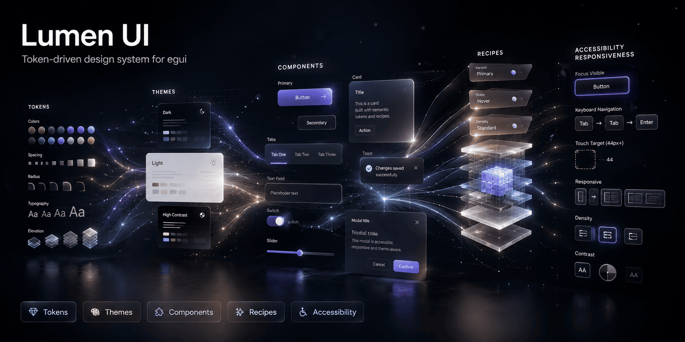

<div align="center">



# lumen-ui

**Un design system thémable, piloté par des tokens, pour [egui](https://github.com/emilk/egui).**

[](https://github.com/Rwanbt/lumen-ui/actions/workflows/ci.yml)
[](#licence)
[](https://github.com/emilk/egui)

</div>

<div align="center">

  **[ 🇬🇧 [Read in English](README.md) &nbsp;|&nbsp; 🇫🇷 Français ]**

</div>

> 🚧 **En cours de développement — pas encore publié sur crates.io.** Le code est complet et l'API
> publique est gelée pour une *release candidate* `1.0.0`, mais il n'a pas encore été publié ni
> éprouvé en production. Utilise-le via une dépendance git et attends-toi à quelques aspérités.
> Retours bienvenus.

## C'est quoi ?

[**egui**](https://github.com/emilk/egui) est une bibliothèque GUI *immediate-mode* populaire pour
Rust — utilisée pour des applis desktop, des outils de dev, des UIs de jeux et des interfaces de
plugins audio. Elle est excellente, mais son style repose sur **un unique `Style` global et
impératif** : on mute une seule structure pour tout le contexte, les couleurs et espacements
finissent codés en dur dans les widgets, et il n'existe aucune notion intégrée de *thème* qu'on
conçoit une fois puis qu'on permute.

**lumen-ui est la couche design system qu'egui ne fournit pas.** Elle sépare *ce qu'est un widget*
de *son apparence* :

```text
Tokens de design ──(un Theme résout)──► une Recipe par (variant, état, densité) ──► le Widget dessine
```

Un widget ne code jamais une couleur ou un padding en dur — il demande au **thème** installé une
**recipe** construite à partir de **tokens** sémantiques. Permute le thème et toute ton appli se
restyle, instantanément, **sans toucher une seule ligne de logique de widget ou d'application**.

## Les problèmes qu'il résout

| Douleur avec egui brut | Ce que lumen-ui apporte |
|------------------------|-------------------------|
| Couleurs/espacements codés en dur et dupliqués partout | **Une source de vérité visuelle** — des tokens sémantiques, plus de `Color32::from_rgb(...)` éparpillés |
| Pas de vrai thème ; restyler = éditer le code des widgets | **Thématisation à chaud** — `set_theme(ctx, …)` restyle toute l'appli en un appel |
| Difficile de livrer des variantes dark/light/marque/contraste élevé | Un **thème = une palette + un mode** ; un nouveau thème ne demande *aucun* code de recipe (`PaletteTheme`) |
| L'accessibilité est à ta charge | Chaque thème intégré est **audité WCAG 2.1 AA en CI** ; focus visible, navigation clavier, cibles tactiles de 44 px |
| Widgets incohérents, état ad hoc | Un ensemble de widgets cohérent + des composants *headless* (Modal/Toast/Tabs) qui gèrent leur propre état |
| egui casse ~3×/an | egui épinglé derrière une **couche d'adaptation unique** ; un seul endroit à mettre à jour |

## Pour qui ?

Toute personne qui construit une appli egui non triviale et veut un rendu cohérent, thémable et
accessible sans réinventer une couche de style — outils desktop, dashboards, logiciels
créatifs/audio, applis internes.

## Principes de design

- **Cœur profond et stable** — les recipes sont paramétrées par `(variant, état, densité)` dès le
  premier jour ; ajouter des états/variants/thèmes plus tard est **additif, pas cassant**
  ([ADR-0002](docs/adr/0002-recipes-parameterized-by-state.md)).
- **Rapide** — la résolution d'une recipe prend ~26 ns (une frame de 300 widgets passe <10 µs en
  thématisation ; voir [docs/performance.md](docs/performance.md)).
- **egui honnête** — chaque signature egui est vérifiée par compilation, jamais supposée.
- **On ne paie que ce qu'on utilise** — feature flags optionnels ; le cœur ne tire qu'`egui`.

## Démarrage rapide

```toml
[dependencies]
lumen-ui = { git = "https://github.com/Rwanbt/lumen-ui" }   # crates.io à la v1.0
eframe = "0.34"
```

```rust
use std::sync::Arc;
use eframe::egui;
use lumen_ui::prelude::*;

// une fois, au démarrage :
install(&cc.egui_ctx, Arc::new(DarkTheme::new()), UiContext::default());

// n'importe où dans ton UI :
if ui.add(Button::primary("Enregistrer")).clicked() {
    // ...
}
```

Lance l'exemple de validation :

```bash
cargo run -p lumen-ui --example minimal
```

## Organisation du workspace

| Crate | Rôle | Feature | Statut |
|-------|------|---------|--------|
| `lumen-core` | Tokens, densité/contexte, trait `Theme`, recipes, `install()`, audit a11y | `theme` | ✅ |
| `lumen-widgets` | Widgets thémés (Button, TextField, Switch, Slider, Card, Tabs, Modal, Toast…) | `widgets` | ✅ |
| `lumen-layout` | flex/grid `egui_taffy` + breakpoints responsives | `layout` | ✅ |
| `lumen-motion` | Springs, easings, transitions fade | `motion` | ✅ |
| `lumen-patterns` | DashboardLayout, Sidebar, LogPanel, CommandPalette… | `patterns` | ✅ |
| `lumen-themes` | Famille de thèmes (`audio_dark`, `high_contrast`) | `themes` | ✅ |
| `lumen-icons` | Jeu d'icônes dessinées au painter | `icons` | ✅ |
| `lumen-ui` | Façade : re-exports, prélude, feature flags | — | ✅ |
| `tools/lumen-theme-gen` | CLI : palette RON ⇄ `PaletteTheme` Rust | — | ✅ |

Un **workspace dès le jour zéro** (pas de « grand découpage » plus tard) ;
[ADR-0001](docs/adr/0001-workspace-from-day-zero.md). Active tout avec `features = ["full"]`.

> Un adaptateur `material` (egui-material3) était prévu mais **reporté** — cette crate cible
> egui 0.33 et tire ~465 deps transitives ; [ADR-0005](docs/adr/0005-defer-material-adapter.md).

## Accessibilité

Chaque thème intégré est **audité WCAG 2.1 AA en CI**. Les widgets sont navigables au clavier avec
un anneau de focus visible et des cibles tactiles de 44 px en `Density::Touch`. Voir
[le chapitre a11y](docs/book/src/accessibility.md).

## Compatibilité

| lumen-ui | egui | MSRV |
|----------|------|------|
| 1.0.x | 0.34.x | Rust 1.92 |

egui est épinglé dans une couche d'adaptation unique ([ADR-0004](docs/adr/0004-msrv-egui-pin.md)) ;
une nouvelle mineure d'egui se gère à un seul endroit et se livre en mineure lumen-ui au plus.

## Documentation

- **[Le livre](docs/book/)** — guide complet (démarrage → patterns). `mdbook serve docs/book`.
- [ROADMAP.md](ROADMAP.md) — le plan verrouillé, version par version.
- [ARCHITECTURE.md](ARCHITECTURE.md) — couches, flux de données, ownership, zones rouges.
- [docs/api-freeze.md](docs/api-freeze.md) — la surface publique gelée de la v1.0.
- [docs/performance.md](docs/performance.md) — budgets des chemins chauds + mesures.
- [CONTRIBUTING.md](CONTRIBUTING.md) · [docs/glossary.md](docs/glossary.md) · [docs/adr/](docs/adr/)

## Licence

Distribué au choix sous [licence Apache, version 2.0](LICENSE-APACHE) ou
[licence MIT](LICENSE-MIT). Sauf indication contraire explicite de ta part, toute contribution que
tu soumets intentionnellement pour inclusion dans cette crate, telle que définie par la licence
Apache-2.0, sera distribuée sous cette double licence, sans condition supplémentaire.
